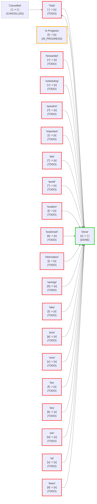

# 查看并检查您的状态

## 关于此文件

此文件由 Obsidian tasks 插件(version 7.18.1)创建,以帮助可视化此仓库中的任务状态.

如果更改 Tasks 状态设置,则可以通过以下方式获取更新后的报告:

- 前往 `设置` -> `Tasks`。
- 点击 `查看并检查您的状态`。

您可以随时删除此文件.

## 状态设置

<!--
切换到实时预览或阅读模式以查看表格.
如果状态名称中有任何Markdown格式字符,如 '*' 或 '_',
黑曜石只能在阅读模式下正确渲染表格.
-->

这些是核心和自定义状态部分中的状态值.

| 状态符号    | 下一个状态符号 | 状态名称        | 状态类型          | 问题 (如果存在)                |
| ------- | ------- | ----------- | ------------- | ------------------------ |
| `space` | `x`     | Todo        | `TODO`        |                          |
| `x`     | `space` | Done        | `DONE`        |                          |
| `/`     | `x`     | In Progress | `IN_PROGRESS` |                          |
| `-`     | `space` | Cancelled   | `CANCELLED`   |                          |
| `space` | `x`     | to-do       | `TODO`        | 重复的符号 '`space`':此状态将被忽略. |
| `/`     | `x`     | incomplete  | `IN_PROGRESS` | 重复的符号 '`/`':此状态将被忽略.     |
| `x`     | `space` | done        | `DONE`        | 重复的符号 '`x`':此状态将被忽略.     |
| `-`     | `space` | canceled    | `CANCELLED`   | 重复的符号 '`-`':此状态将被忽略.     |
| `>`     | `x`     | forwarded   | `TODO`        |                          |
| `<`     | `x`     | scheduling  | `TODO`        |                          |
| `?`     | `x`     | question    | `TODO`        |                          |
| `!`     | `x`     | important   | `TODO`        |                          |
| `*`     | `x`     | star        | `TODO`        |                          |
| `"`     | `x`     | quote       | `TODO`        |                          |
| `l`     | `x`     | location    | `TODO`        |                          |
| `b`     | `x`     | bookmark    | `TODO`        |                          |
| `i`     | `x`     | information | `TODO`        |                          |
| `S`     | `x`     | savings     | `TODO`        |                          |
| `I`     | `x`     | idea        | `TODO`        |                          |
| `p`     | `x`     | pros        | `TODO`        |                          |
| `c`     | `x`     | cons        | `TODO`        |                          |
| `f`     | `x`     | fire        | `TODO`        |                          |
| `k`     | `x`     | key         | `TODO`        |                          |
| `w`     | `x`     | win         | `TODO`        |                          |
| `u`     | `x`     | up          | `TODO`        |                          |
| `d`     | `x`     | down        | `TODO`        |                          |

## 已加载设置

<!-- 切换到实时预览或阅读模式以查看图表. -->

这些是 Tasks 实际使用的设置.

