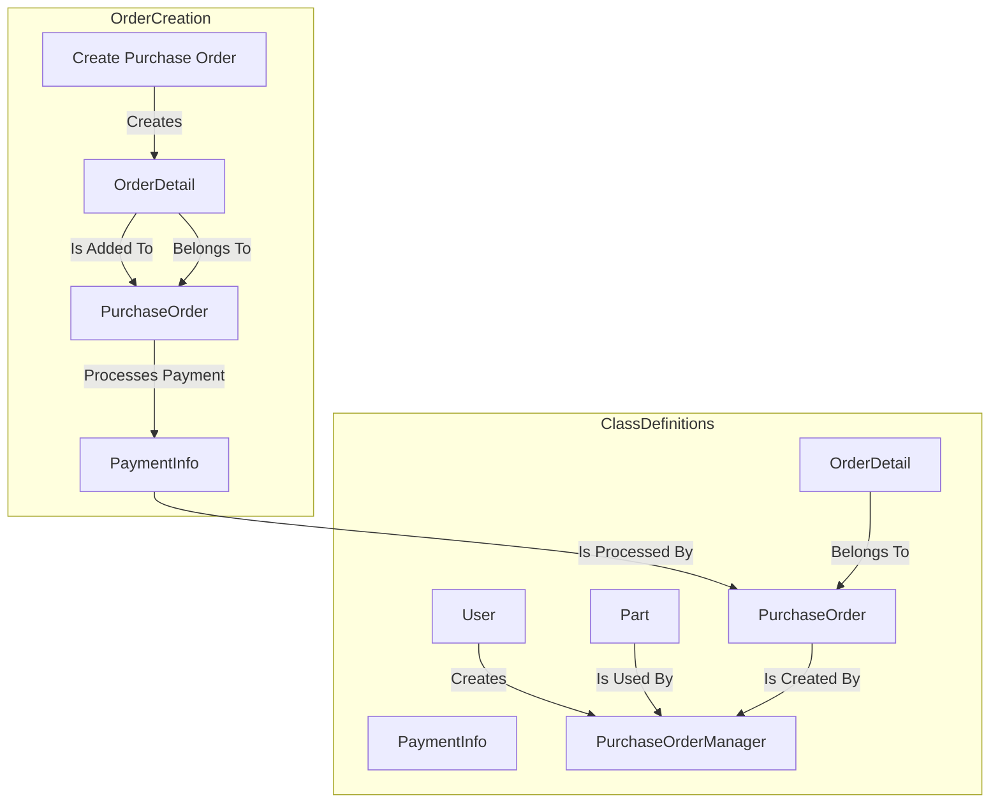

```mermaid
graph TD
    subgraph OrderCreation
        A[Create Purchase Order] -->|Creates| B[OrderDetail]
        B -->|Is Added To| C[PurchaseOrder]
        C -->|Processes Payment| D[PaymentInfo]
    end

    subgraph ClassDefinitions
        E[User]
        F[Part]
        G[PurchaseOrder]
        H[OrderDetail]
        I[PaymentInfo]
        J[PurchaseOrderManager]
    end

    E -->|Creates| J
    F -->|Is Used By| J
    G -->|Is Created By| J
    D -->|Is Processed By| G
    B -->|Belongs To| C
    H -->|Belongs To| G


```

