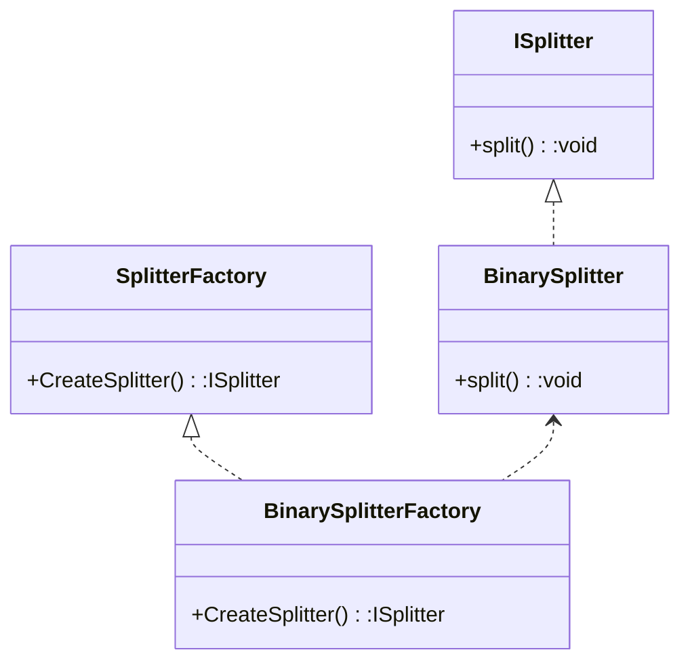

---
tags:
  - 软件设计师
aliases:
  - FactoryMethod
  - Factory Method
---
通过"对象创建"模式绕开`new`,来避免对象创建(new)过程中所导致的紧耦合([[设计原则#1. 依赖倒转原则]]),从而支持对象创建的稳定.它是接口抽象之后的第一步工作

工厂方法属于简单工厂的衍生方法,它继承了简单工厂的有点,并弥补了简单工厂的缺点

优点

> 在工厂方法模式中，工厂方法用来创建具体类的实例，同时向客户隐藏了具体类实例化的细节，用户只需要关心具体类对应的工厂，无需关心实例创建的细节以及甚至不需要关心具体类的类名，实现具体类与用户之间的解耦。
> 
> 基于工厂接口和具体类型的公共接口的多态性设计是工厂方法模式的关键。它能够让工厂能够自主确定创建何种具体实现类的对象，但是具体对象的创建细节又封装到了具体工厂的内部。工厂方法模式被称为多态工厂模式，就正是因为所有的具体工厂类都有一个公共的接口或者父类。
> 
> 使用工厂方法模式的另外一个优点就是在系统中加入新的具体类时，无需修改原有的代码，只需要增加新类的实现以及新类对应的工厂即可，完全符合“开闭原则”。

缺点

> 添加新的具体实现类时，需要添加对应的工厂类，系统中的类的个数会成对增加，在一定程度上增加了系统的复杂度；类的增多就有更多的类需要编译，增加系统的开销。
>
> 由于考虑到系统的可扩展性,需要引入抽象层,在客户端代码中均使用抽象层进行定义,增加了系统的抽象性和理解难度,且在实现时可能需要用到DOM、 反射等技术,增加了系统的实现难度。


典型模式

- [[简单工厂|Simple Factory]]
- [[工厂方法|Factory Method]]
- [[抽象工厂|Abstract Factory]]
- [[生成器|Builder]]
- [[原型|Prototype]]


给出上下文

现在需要一个文件分割器,这个文件分割器可以分割多种类型的文件

在没有使用工厂模式的情况下,写出的代码和以下的差不多

```c++
class ISplitter {
public:
  virtual void split() = 0;
  virtual ~ISplitter(){};
};

class BinarySplitter : public ISplitter {
public:
  virtual void split() {}
  ~BinarySplitter(){};
};

class VideoSplitter : public ISplitter {
public:
  virtual void split() {}
  ~VideoSplitter(){};
};

class MainForm {
public:
  void Button_Click() {
    //因为在普通方法中使用了new,使得此处依赖了一个具体类VideoSplitter,违反了依赖倒转原则
    ISplitter *splitter = new VideoSplitter();
    splitter->split();
  }
};
```

在这里,一般写法违反了[[设计原则#1.依赖倒转原则]],可以使用简单工厂,消除这个问题,但是简单工厂也存在它的缺点,其内部的创建方法是固定的,如果其创建方法本身出了问题,则这个工厂创建的所有实例都有可能出问题,且因为[[设计原则#4. 开闭原则]]的存在,我们不能随意的修改已经设定好的方法,所以我们需要使用到工厂方法

```c++
class SplitterFactory {
public:
  virtual ISplitter *CreateSplitter() = 0;
  virtual ~SplitterFactory() {}
};

class BinarySplitterFactory : public SplitterFactory {
public:
  virtual ISplitter *CreateSplitter() { return new BinarySplitter(); }
  virtual ~BinarySplitterFactory() {}
};

class VideoSplitterFactory : public SplitterFactory {
public:
  virtual ISplitter *CreateSplitter() { return new VideoSplitter(); }
  virtual ~VideoSplitterFactory() {}
};

class MainForm {
public:
  void Button_Click() {
    SplitterFactory* factory;
    ISplitter *splitter = factory->CreateSplitter();
    splitter->split();
  }
};
```

这里解决了有关依赖倒转的问题,可是作为创建者的工厂本身没有实例又该怎么去给他一个实例让他调用呢

我们可以将工厂转为一个成员变量,让类在初始化的时候给利用传参的方式让工厂拥有实例

```c++
class MainForm {
private:
  SplitterFactory *factory_;

public:
  MainForm(SplitterFactory *factory) { factory_ = factory; }

  void Button_Click() {
    ISplitter *splitter = factory_->CreateSplitter();
    splitter->split();
  }
};

```

至此,在这个功能类中就不存在依赖倒转的问题了,只要在使用功能时传入需要的参数就可以调用不同的功能,这也可以大大提高后期增加需求的时候程序的灵活性

**整体代码如下**

```c++
class ISplitter {
public:
  virtual void split() = 0;
  virtual ~ISplitter(){};
};

class BinarySplitter : public ISplitter {
public:
  virtual void split() {}
  ~BinarySplitter(){};
};

class VideoSplitter : public ISplitter {
public:
  virtual void split() {}
  ~VideoSplitter(){};
};

class SplitterFactory {
public:
  virtual ISplitter *CreateSplitter() = 0;
  virtual ~SplitterFactory() {}
};

class BinarySplitterFactory : public SplitterFactory {
public:
  virtual ISplitter *CreateSplitter() { return new BinarySplitter(); }
  virtual ~BinarySplitterFactory() {}
};

class VideoSplitterFactory : public SplitterFactory {
public:
  virtual ISplitter *CreateSplitter() { return new VideoSplitter(); }
  virtual ~VideoSplitterFactory() {}
};

class MainForm {
private:
  SplitterFactory *factory_;

public:
  MainForm(SplitterFactory *factory) { factory_ = factory; }

  void Button_Click() {
    ISplitter *splitter = factory_->CreateSplitter();
    splitter->split();
  }
};
```

# UML设计


