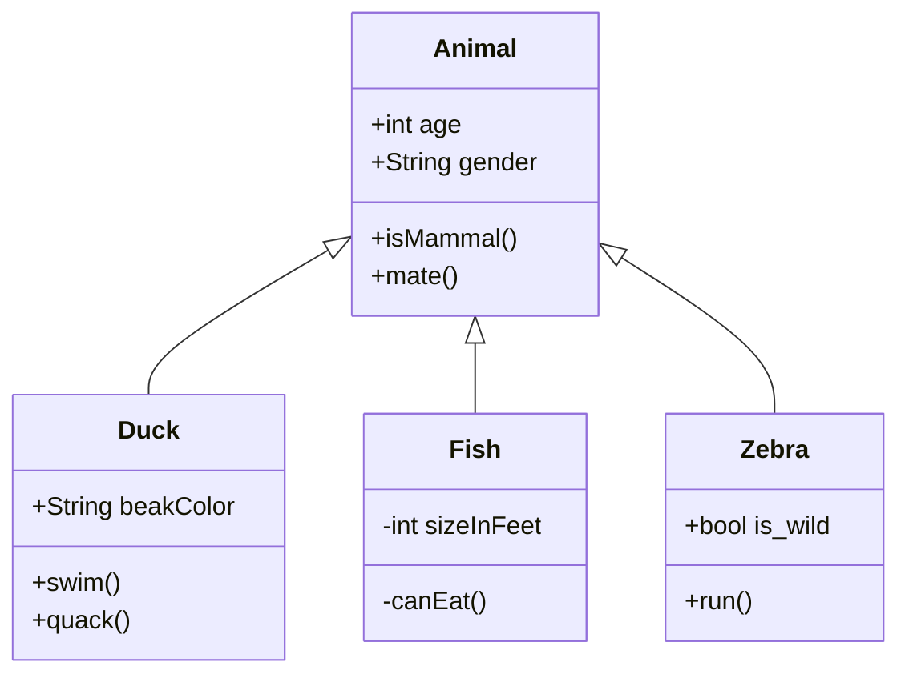

---
tags:
  - 软件设计师
aliases:
  - Adapter
---

在组件构建过程中，某些接口之间直接的依赖常常会带来很多问题、甚至根本无法实现。采用添加一层间接（稳定）接口，来隔离本来互相紧密关联的接口是一种常见的解决方案

典型模式

- [[外观|Facade]]
- [[代理|Proxy]]
- [[适配器|Adapter]]
- [[Mediator]]

在软件系统中，由于应用环境的变化，常常需要将“一些现存的对象”放在新的环境中应用，但是新环境要求的接口是这些现存对象所不满足的

如何因对这种“迁移的变化”？如何既能利用现有对象的良好实现，同时又能满足新的应用环境所要求的接口？

## 模式定义

将一个类的接口转换成客户希望的另一个接口。Adapter模式使得原本由于接口不兼容而不能一起工作的那些类可以一起工作

## UML设计

