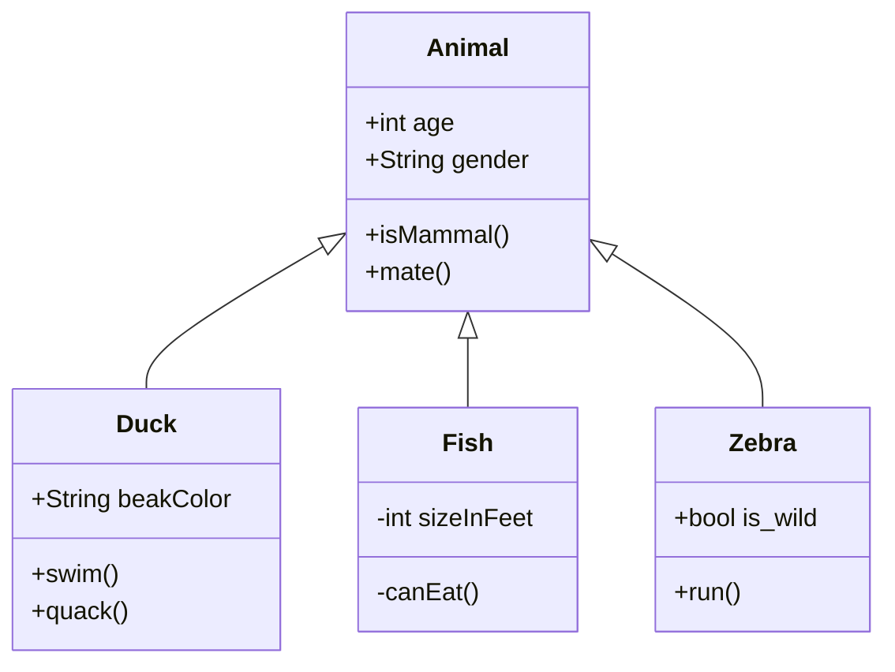
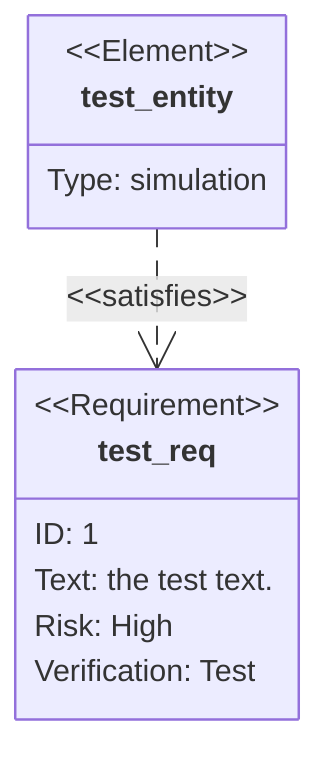

[UML](https://zh.wikipedia.org/wiki/统一建模语言) 是统一建模语言的简称，它是一种由一整套图表组成的标准化建模语言。UML用于帮助系统开发人员阐明，展示，构建和记录软件系统的产出。UML代表了一系列在大型而复杂系统建模中被证明是成功的做法，是开发面向对象软件和软件开发过程中非常重要的一部分。UML主要使用图形符号来表示软件项目的设计，使用UML可以帮助项目团队沟通、探索潜在的设计和验证软件的架构设计。以下我们将向您详细介绍什么是UML、UML的历史以及每个UML图类型的描述，辅之以UML示例。

## UML - 概述

在我们开始研究 UML 的理论之前，我们将简单介绍一下 UML 的一些主要概念。

首先要注意的是 UML 涉及很多不同的图表（模型），其原因是提供从许多不同的角度来審視系统。软件开发流程往往有许多持分者参与其中，例如：

- 分析师
- 设计师
- 程序员
- 测试员
- 质量保证员
- 客户
- 技术文件撰稿员

这些人都对系统的不同方面各持不同兴趣，故此在建模时需要考虑不同的细节层次。例如，程序员需要了解系统的设计，并将设计转换为代码，而技术文件撰稿员则对整个系统的行为感兴趣，借以了解产品的功能。UML 提供了极富表达能力的建模语言，好让各持分者至少可以从一个 UML 图表得到感兴趣的资讯。

以下简要地介绍了这 13 个 UML 图表。UML 图表可大致分为结构性图表和行为性图表两种。

结构性图表显示了系统在不同抽象层次和实现层次上的静态结构以及它们之间的相互关系。结构性图表中的元素表示系统中具意义的概念，可能包括抽象的、现实的和實作的概念。结构性图表有七种类型：

- [类图 (Class Diagram)](https://www.visual-paradigm.com/cn/guide/uml-unified-modeling-language/what-is-uml/#class-diagram)
- [组件图 (Component Diagram)](https://www.visual-paradigm.com/cn/guide/uml-unified-modeling-language/what-is-uml/#component-diagram)
- [部署图 (Deployment Diagram)](https://www.visual-paradigm.com/cn/guide/uml-unified-modeling-language/what-is-uml/#deployment-diagram)
- [对象图 (Object Diagram)](https://www.visual-paradigm.com/cn/guide/uml-unified-modeling-language/what-is-uml/#object-diagram)
- [包图 (Package Diagram)](https://www.visual-paradigm.com/cn/guide/uml-unified-modeling-language/what-is-uml/#package-diagram)
- [复合结构图 (Composite Structure Diagram)](https://www.visual-paradigm.com/cn/guide/uml-unified-modeling-language/what-is-uml/#composite-structure-diagram)
- [轮廓图 (Profile Diagram)](https://www.visual-paradigm.com/cn/guide/uml-unified-modeling-language/what-is-uml/#profile-diagram)

行为性图表显示了系统中对象的动态行为 ，可用以表达系统随时间的变化。行为性图表有七种类型：

- [用例图 (Use Case Diagram)](https://www.visual-paradigm.com/cn/guide/uml-unified-modeling-language/what-is-uml/#use-case-diagram)
- [活动图 (Activity Diagram)](https://www.visual-paradigm.com/cn/guide/uml-unified-modeling-language/what-is-uml/#activity-diagram)
- [状态机图 (State Machine Diagram)](https://www.visual-paradigm.com/cn/guide/uml-unified-modeling-language/what-is-uml/#state-machine-diagram)
- [序列图 (Sequence Diagram)](https://www.visual-paradigm.com/cn/guide/uml-unified-modeling-language/what-is-uml/#sequence-diagram)
- [通訊圖 (Communication Diagram)](https://www.visual-paradigm.com/cn/guide/uml-unified-modeling-language/what-is-uml/#communication-diagram)
- [交互概述图 (Interaction Overview Diagram)](https://www.visual-paradigm.com/cn/guide/uml-unified-modeling-language/what-is-uml/#interaction-overview-diagram)
- [时序图 (Timing Diagram)](https://www.visual-paradigm.com/cn/guide/uml-unified-modeling-language/what-is-uml/#timing-diagram)

## 类图

类图是一切面向对象方法的核心建模工具。该图描述了系统中对象的类型以及它们之间存在的各种静态关系。

#### 关系

有三种主要的关系：

1. 关联 - 代表类型之间的关系（一个人为公司工作，一间公司有多个办事处）。
2. 继承 - 专为将实例关系图 (ERD) 应用于面向对象设计而设的一种关系。它在面向对象设计中的继承概念互相呼应。
3. 聚合 - 面向对象设计中的一种对象组合的形式。

空心白色箭头实线表示继承关系，就是编程语言意义上的继承，也被称为泛化，

空心白色箭头虚线表示实现关系，实现接口

黑色实心箭头表示聚合关系，

无箭头连线表示关联

具体类在类图中用矩形框表示，矩形框分为三层：第一层是类名字。第二层是类的成员变量；第三层是类的方法。成员变量以及方法前的访问修饰符用符号来表示：

- “+”表示 `public`；
- “-”表示 `private`；
- “#”表示 `protected`；
- 不带符号表示 `default`。

### 类图示例

## 组件图

在统一建模语言中，组件图描绘了组件如何连接在一起以形成更大的组件或软件系统。它展示了软件组件的体系结构以及它们之间的依赖关系。那些软件组件包括运行时组件，可执行组件和源代码组件。

#### 组件图示例

