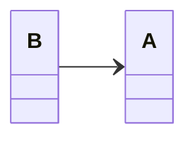
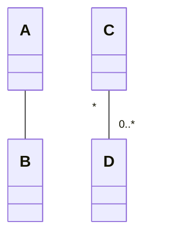
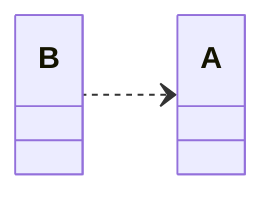
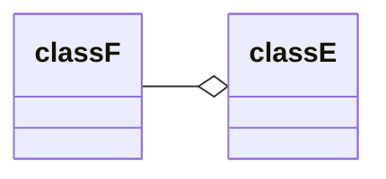
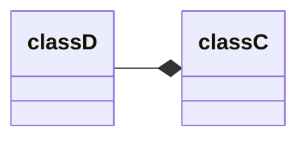

[UML](https://zh.wikipedia.org/wiki/统一建模语言) 是统一建模语言的简称，它是一种由一整套图表组成的标准化建模语言。UML用于帮助系统开发人员阐明，展示，构建和记录软件系统的产出。UML代表了一系列在大型而复杂系统建模中被证明是成功的做法，是开发面向对象软件和软件开发过程中非常重要的一部分。UML主要使用图形符号来表示软件项目的设计，使用UML可以帮助项目团队沟通、探索潜在的设计和验证软件的架构设计。以下我们将向您详细介绍什么是UML、UML的历史以及每个UML图类型的描述，辅之以UML示例。

## UML - 概述

在我们开始研究 UML 的理论之前，我们将简单介绍一下 UML 的一些主要概念。

首先要注意的是 UML 涉及很多不同的图表（模型），其原因是提供从许多不同的角度来審視系统。软件开发流程往往有许多持分者参与其中，例如：

- 分析师
- 设计师
- 程序员
- 测试员
- 质量保证员
- 客户
- 技术文件撰稿员

这些人都对系统的不同方面各持不同兴趣，故此在建模时需要考虑不同的细节层次。例如，程序员需要了解系统的设计，并将设计转换为代码，而技术文件撰稿员则对整个系统的行为感兴趣，借以了解产品的功能。UML 提供了极富表达能力的建模语言，好让各持分者至少可以从一个 UML 图表得到感兴趣的资讯。

以下简要地介绍了这 13 个 UML 图表。UML 图表可大致分为结构性图表和行为性图表两种。

结构性图表显示了系统在不同抽象层次和实现层次上的静态结构以及它们之间的相互关系。结构性图表中的元素表示系统中具意义的概念，可能包括抽象的、现实的和實作的概念。结构性图表有七种类型：

- [类图 (Class Diagram)](https://www.visual-paradigm.com/cn/guide/uml-unified-modeling-language/what-is-uml/#class-diagram)
- [组件图 (Component Diagram)](https://www.visual-paradigm.com/cn/guide/uml-unified-modeling-language/what-is-uml/#component-diagram)
- [部署图 (Deployment Diagram)](https://www.visual-paradigm.com/cn/guide/uml-unified-modeling-language/what-is-uml/#deployment-diagram)
- [对象图 (Object Diagram)](https://www.visual-paradigm.com/cn/guide/uml-unified-modeling-language/what-is-uml/#object-diagram)
- [包图 (Package Diagram)](https://www.visual-paradigm.com/cn/guide/uml-unified-modeling-language/what-is-uml/#package-diagram)
- [复合结构图 (Composite Structure Diagram)](https://www.visual-paradigm.com/cn/guide/uml-unified-modeling-language/what-is-uml/#composite-structure-diagram)
- [轮廓图 (Profile Diagram)](https://www.visual-paradigm.com/cn/guide/uml-unified-modeling-language/what-is-uml/#profile-diagram)

行为性图表显示了系统中对象的动态行为 ，可用以表达系统随时间的变化。行为性图表有七种类型：

- [用例图 (Use Case Diagram)](https://www.visual-paradigm.com/cn/guide/uml-unified-modeling-language/what-is-uml/#use-case-diagram)
- [活动图 (Activity Diagram)](https://www.visual-paradigm.com/cn/guide/uml-unified-modeling-language/what-is-uml/#activity-diagram)
- [状态机图 (State Machine Diagram)](https://www.visual-paradigm.com/cn/guide/uml-unified-modeling-language/what-is-uml/#state-machine-diagram)
- [序列图 (Sequence Diagram)](https://www.visual-paradigm.com/cn/guide/uml-unified-modeling-language/what-is-uml/#sequence-diagram)
- [通訊圖 (Communication Diagram)](https://www.visual-paradigm.com/cn/guide/uml-unified-modeling-language/what-is-uml/#communication-diagram)
- [交互概述图 (Interaction Overview Diagram)](https://www.visual-paradigm.com/cn/guide/uml-unified-modeling-language/what-is-uml/#interaction-overview-diagram)
- [时序图 (Timing Diagram)](https://www.visual-paradigm.com/cn/guide/uml-unified-modeling-language/what-is-uml/#timing-diagram)

## 类图

类图是一切面向对象方法的核心建模工具。该图描述了系统中对象的类型以及它们之间存在的各种静态关系。


具体类在类图中用矩形框表示，矩形框分为三层：第一层是类名字。第二层是类的成员变量；第三层是类的方法。成员变量以及方法前的访问修饰符用符号来表示：

- “+”表示 `public`；
- “-”表示 `private`；
- “#”表示 `protected`；
- 不带符号表示 `default`。

### 在类图中表示关系

类和类、类和接口、接口和接口之间存在一定关系，UML类图中一般会有连线指明它们之间的关系。关系共有六种类型，分别是实现关系、泛化关系、关联关系、依赖关系、聚合关系、组合关系

空心白色箭头实线表示继承关系，就是编程语言意义上的继承，也被称为泛化，关键字 `extends`

空心白色箭头虚线表示实现关系，实现接口关键字 `implements`

黑色实心箭头表示聚合关系，

无箭头连线表示关联

#### 实现关系

实现关系是指接口及其实现类之间的关系。在UML类图中，实现关系用空心三角和虚线组成的箭头来表示，从实现类指向接口。在Java代码中，实现关系可以直接翻译为关键字 `implements`


#### 泛化关系

泛化关系（Generalization）是指对象与对象之间的继承关系。如果对象A和对象B之间的“is a”关系成立，那么二者之间就存在继承关系，对象B是父对象，对象A是子对象。例如，一个年薪制员工“is a”员工，很显然年薪制员工Salary对象和员工Employee对象之间存在继承关系，Employee对象是父对象，Salary对象是子对象。



#### 关联关系

关联关系（Association）是指对象和对象之间的连接，它使一个对象知道另一个对象的属性和方法。在Java中，关联关系的代码表现形式为一个对象含有另一个对象的引用。也就是说，如果一个对象的类代码中，包含有另一个对象的引用，那么这两个对象之间就是关联关系。

关联关系有单向关联和双向关联。如果两个对象都知道（即可以调用）对方的公共属性和操作，那么二者就是双向关联。如果只有一个对象知道（即可以调用）另一个对象的公共属性和操作，那么就是单向关联。大多数关联都是单向关联，单向关联关系更容易建立和维护，有助于寻找可重用的类。



一个对象可以持有其它对象的数组或者集合。在UML中，通过放置多重性（multipicity）表达式在关联线的末端来表示。多重性表达式可以是一个数字、一段范围或者是它们的组合。多重性允许的表达式示例如下：

- 数字：精确的数量
- `*`或者`0..*`：表示0到多个
- `0..1`：表示0或者1个，在Java中经常用一个空引用来实现
- `1..*`：表示1到多个

关联关系又分为依赖关联、聚合关联和组合关联三种类型。


#### 依赖关系

依赖（Dependency）关系是一种弱关联关系。如果对象A用到对象B，但是和B的关系不是太明显的时候，就可以把这种关系看作是依赖关系。如果对象A依赖于对象B，则 A “use a” B。比如驾驶员和汽车的关系，驾驶员使用汽车，二者之间就是依赖关系。

在UML类图中，依赖关系用一个带虚线的箭头表示，由使用方指向被使用方，表示使用方对象持有被使用方对象的引用，如图10所示。



依赖关系在Java中的具体代码表现形式为**B为A的构造器**或**方法中的局部变量**、**方法或构造器的参数**、**方法的返回值**，或者**A调用B的静态方法**。

```java
//代码清单1 B.java
public class B {
  public String field1;   //成员变量

  public void method1() {
    System.println("在类B的方法1中");
  }

  public static void method2() {                 //静态方法
    System.out.println("在类B的静态方法2中");
  }
}
```

代码清单2所示的`A`类依赖于`B`类，在`A`类中定义了四个方法，分别演示四种依赖形式。

```java
/* 代码清单2 A.java
  A依赖于B
*/

public class A {
  public void method1() {
    //A依赖于B的第一种表现形式：B为A的局部变量
    B b = new B();
    b.method1();
  }

  public void method2() {
    //A依赖于B的第二种表现形式： 调用B的静态方法
    B.method2();
  }

  public void method3(B b)  {
    //A依赖于B的第三种表现形式：B作为A的方法参数
    String s = b.field1;
  }

  //A依赖于B的第四种表现形式：B作为A的方法的返回值
  public B method4() {
    return new B();
  }
}
```


#### 聚合关系与组合关系

聚合（Aggregation）是关联关系的一种特例，它体现的是整体与部分的拥有关系，即 “has a” 的关系。此时整体与部分之间是可分离的，它们可以具有各自的生命周期，部分可以属于多个整体对象，也可以为多个整体对象共享，所以聚合关系也常称为共享关系。例如，公司部门与员工的关系，一个员工可以属于多个部门，一个部门撤消了，员工可以转到其它部门。



组合（Composition）也是关联关系的一种特例，它同样体现整体与部分间的包含关系，即 “contains a” 的关系。但此时整体与部分是不可分的，部分也不能给其它整体共享，作为整体的对象负责部分的对象的生命周期。这种关系比聚合更强，也称为强聚合。如果`A`组合`B`，则`A`需要知道`B`的生存周期，即可能`A`负责生成或者释放`B`，或者`A`通过某种途径知道`B`的生成和释放。




拥有聚合关系的两个物体可以独立于对方存在，而组合关系只能同时存在同时消失

